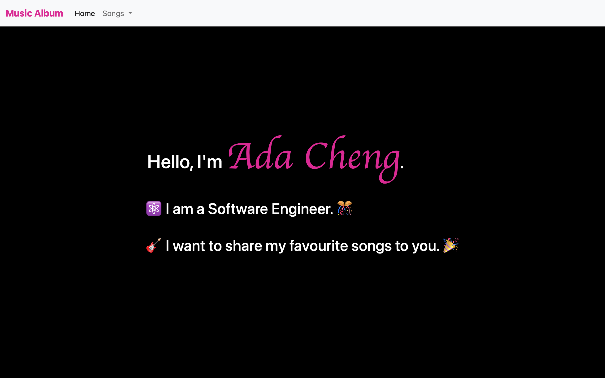

# Music Album

> Build a Web Site listing my favourite song using node.js.



## Live Demo

Available at the following hosting platforms:
1. Node.js hosted at [Vercel](https://music-album-liart.vercel.app)

## Development

1. Create `package.json` file.

```json
{
   "name": "music-album",
   "version": "1.0.0",
   "description": "Music Album",
   "author": "adafycheng",
   "license": "MIT",
   "private": true,
   "main": "app.js",
   "dependencies": {
      "js-yaml": "^4.1.0",
      "jsdom": "^19.0.0"
   },
   "scripts": {
      "start": "node app.js"
   }
}
```

2. Install the packages by running `npm update`.  Note that `package-lock.json` is automatically created.

3. Create source code /app.js.

4. Start the application locally.
    ```sh
    node app.js
    ```

5. Verify by opening the following URL in broswer.
    ```sh
    http://localhost:3000
    ```

## Deployment

1. To deploy serverless function in Vercel, add a vercel.json in root directory of the project.

    ```json
    {
     "version": 2,
     "name": "music-album",
     "builds": [
       { "src": "app.js", "use": "@vercel/node" }
     ],
     "routes": [
       { "src": "/(.*)", "dest": "/app.js" }
     ]
    }
    ```

2. Commit the source code to GitHub.

3. Create a project in Vercel.  Configure the project by importing the GitHub project.

4. Deploy the project.


## Acknowledgements

1. [Deploy Node.js application to Vercel in 5 minutes](https://blog.adafycheng.dev/deploy-nodejs-application-to-vercel-in-5-minutes).
